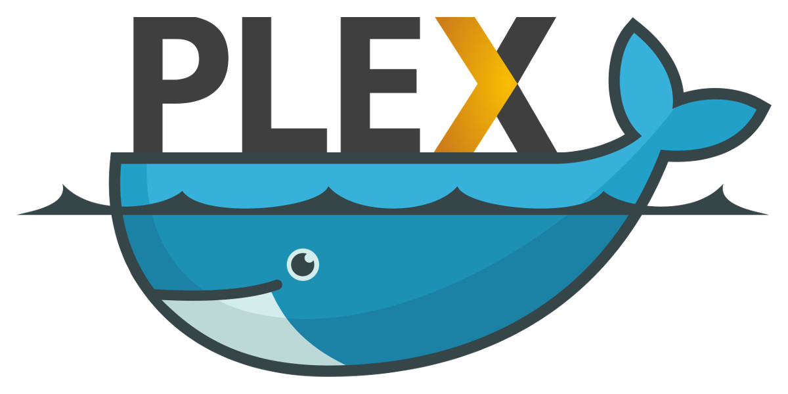

docker-plex
===========

-----

Docker image for Plex Media Server.

### Running the container

Create a named volume for holding persistant data:

    docker volume create plex-data

Run the Plex server:

    docker run -d -p 32400:32400 -v /local/dir:/srv/media:ro -v plex-data:/var/lib/plexmediaserver --name plex-media-server phlak/plex

**NOTE:** Replace `/local/dir` with the path to your media folder on the host OS to share the media
with the running container.

##### Optional arguments

`-e TZ=America/Phoenix` - Set the timezone for your server. You can find your timezone in this
                          [list of timezones](https://goo.gl/uy1J6q). Use the (case sensitive)
                          value from the `TZ` column. If left unset, timezone will be UTC.

`--restart unless-stopped` - Always restart the container regardless of the exit status, but do not
                             start it on daemon startup if the container has been put to a stopped
                             state before. See the Docker [restart policies](https://goo.gl/Y0dlDH)
                             for additional details.

### Image versions

When creating your container you may specify a tag to use. For example, if you
would like to run the current Plex Pass release you would want to use the
`plex-pass` tag:

    docker run ... phlak/plex:plex-pass

If you don't specify a tag `latest` will be used by default.

##### Available tags

 | Tag       | Description                            |
 | ----------|--------------------------------------- |
 | latest    | Latest public release (same as public) |
 | public    | Latest public release                  |
 | plex-pass | Current Plex Pass release              |

Eeach release (starting with 1.5.3.3580-4b377d295) is also taged and available
if you'd like to run a specific version. You can view the complete list of tags
on Docker Hub at <https://hub.docker.com/r/phlak/plex/tags/>

Troubleshooting
---------------

Please report bugs to the [GitHub Issue Tracker](https://github.com/PHLAK/docker-plex/issues).

Copyright
---------

This project is liscensed under the [MIT License](https://github.com/PHLAK/docker-plex/blob/public/LICENSE).
